# GoxViet Core - Dependency Graphs

This document contains visual diagrams showing the dependencies and relationships between modules in the GoxViet core engine, following Clean Architecture and SOLID principles.

---

## Table of Contents

1. [Layer Dependencies](#layer-dependencies)
2. [Port Implementations](#port-implementations)
3. [Use Case Dependencies](#use-case-dependencies)
4. [Service Dependencies](#service-dependencies)
5. [Module Structure](#module-structure)

---

## Layer Dependencies

### Overall Architecture Layers

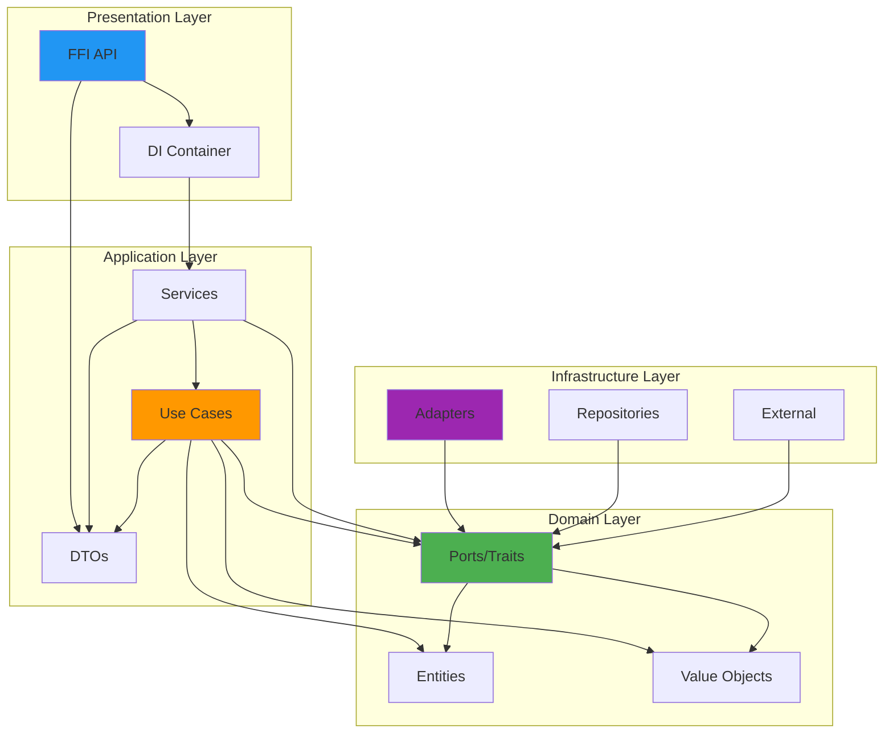
```mermaid
graph TD
    subgraph "Presentation Layer"
        FFI[FFI API]
        DI[DI Container]
    end
    
    subgraph "Application Layer"
        UC[Use Cases]
        SVC[Services]
        DTO[DTOs]
    end
    
    subgraph "Domain Layer"
        ENT[Entities]
        VO[Value Objects]
        PORTS[Ports/Traits]
    end
    
    subgraph "Infrastructure Layer"
        ADAPT[Adapters]
        REPO[Repositories]
        EXT[External]
    end
    
    FFI --> DI
    DI --> SVC
    FFI --> DTO
    
    UC --> PORTS
    SVC --> PORTS
    SVC --> UC
    SVC --> DTO
    UC --> DTO
    UC --> ENT
    UC --> VO
    
    ADAPT --> PORTS
    REPO --> PORTS
    EXT --> PORTS
    
    PORTS --> ENT
    PORTS --> VO
    
    style PORTS fill:#4CAF50
    style FFI fill:#2196F3
    style UC fill:#FF9800
    style ADAPT fill:#9C27B0
```

**Key Points:**
- **Inner layers** (Domain) have NO dependencies on outer layers
- **Outer layers** depend on inner layers (Dependency Inversion)
- **Ports** define abstractions, **Adapters** implement them

---

## Port Implementations

### Input Method Ports

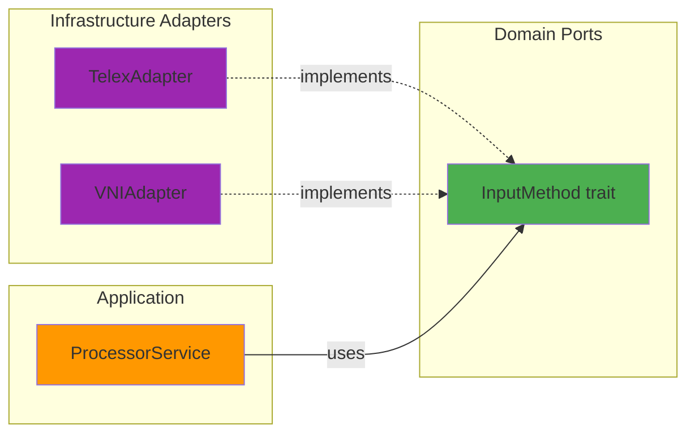
```mermaid
graph LR
    subgraph "Domain Ports"
        IM[InputMethod trait]
    end
    
    subgraph "Infrastructure Adapters"
        TELEX[TelexAdapter]
        VNI[VNIAdapter]
    end
    
    subgraph "Application"
        PS[ProcessorService]
    end
    
    TELEX -.implements.-> IM
    VNI -.implements.-> IM
    PS -->|uses| IM
    
    style IM fill:#4CAF50
    style TELEX fill:#9C27B0
    style VNI fill:#9C27B0
    style PS fill:#FF9800
```

---

### Validation Ports

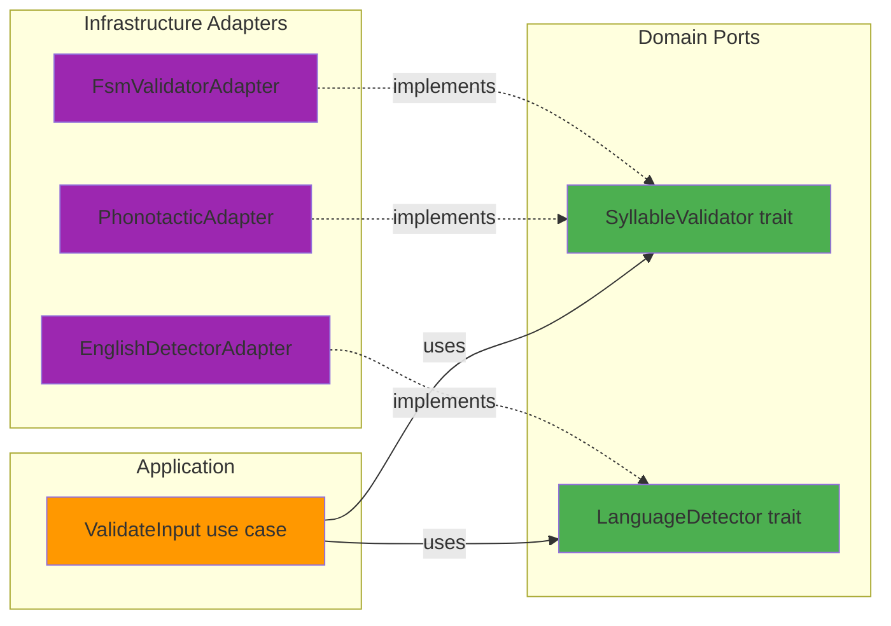
```mermaid
graph LR
    subgraph "Domain Ports"
        SV[SyllableValidator trait]
        LD[LanguageDetector trait]
    end
    
    subgraph "Infrastructure Adapters"
        FSM[FsmValidatorAdapter]
        PHONO[PhonotacticAdapter]
        LANG[EnglishDetectorAdapter]
    end
    
    subgraph "Application"
        VI[ValidateInput use case]
    end
    
    FSM -.implements.-> SV
    PHONO -.implements.-> SV
    LANG -.implements.-> LD
    VI -->|uses| SV
    VI -->|uses| LD
    
    style SV fill:#4CAF50
    style LD fill:#4CAF50
    style FSM fill:#9C27B0
    style PHONO fill:#9C27B0
    style LANG fill:#9C27B0
    style VI fill:#FF9800
```

---

### Transformation Ports

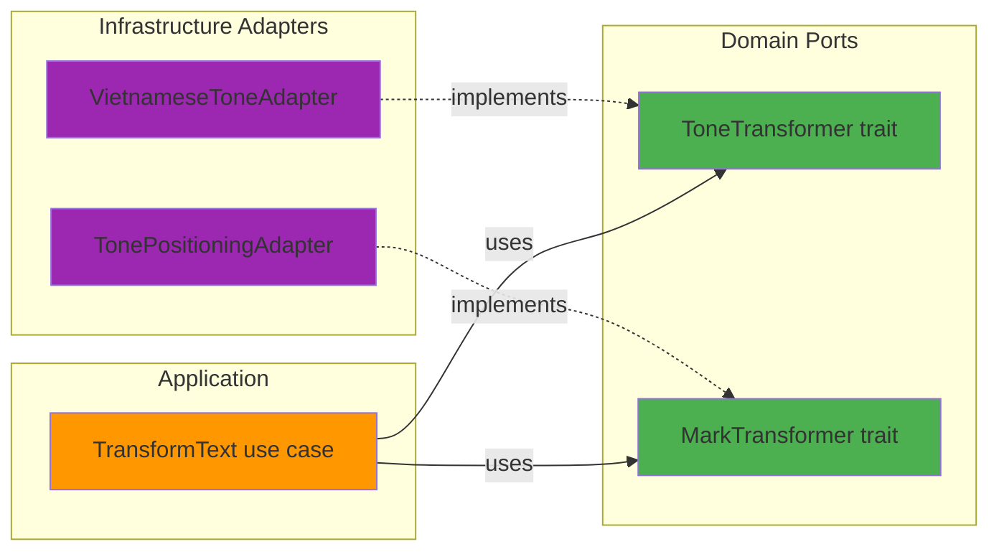
```mermaid
graph LR
    subgraph "Domain Ports"
        TT[ToneTransformer trait]
        MT[MarkTransformer trait]
    end
    
    subgraph "Infrastructure Adapters"
        VT[VietnameseToneAdapter]
        TP[TonePositioningAdapter]
    end
    
    subgraph "Application"
        TX[TransformText use case]
    end
    
    VT -.implements.-> TT
    TP -.implements.-> MT
    TX -->|uses| TT
    TX -->|uses| MT
    
    style TT fill:#4CAF50
    style MT fill:#4CAF50
    style VT fill:#9C27B0
    style TP fill:#9C27B0
    style TX fill:#FF9800
```

---

### State Management Ports

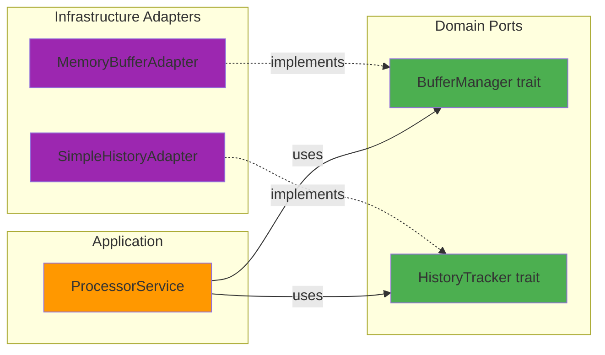
```mermaid
graph LR
    subgraph "Domain Ports"
        BM[BufferManager trait]
        HT[HistoryTracker trait]
    end
    
    subgraph "Infrastructure Adapters"
        MB[MemoryBufferAdapter]
        SH[SimpleHistoryAdapter]
    end
    
    subgraph "Application"
        PS[ProcessorService]
    end
    
    MB -.implements.-> BM
    SH -.implements.-> HT
    PS -->|uses| BM
    PS -->|uses| HT
    
    style BM fill:#4CAF50
    style HT fill:#4CAF50
    style MB fill:#9C27B0
    style SH fill:#9C27B0
    style PS fill:#FF9800
```

---

## Use Case Dependencies

### ProcessKeystroke Use Case

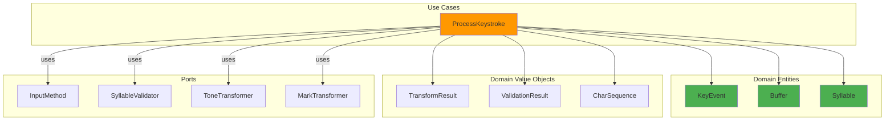
```mermaid
graph TD
    subgraph "Use Cases"
        PK[ProcessKeystroke]
    end
    
    subgraph "Domain Entities"
        KE[KeyEvent]
        BUF[Buffer]
        SYL[Syllable]
    end
    
    subgraph "Domain Value Objects"
        TR[TransformResult]
        VR[ValidationResult]
        CS[CharSequence]
    end
    
    subgraph "Ports"
        IM[InputMethod]
        SV[SyllableValidator]
        TT[ToneTransformer]
        MT[MarkTransformer]
    end
    
    PK --> KE
    PK --> BUF
    PK --> SYL
    PK --> TR
    PK --> VR
    PK --> CS
    PK -->|uses| IM
    PK -->|uses| SV
    PK -->|uses| TT
    PK -->|uses| MT
    
    style PK fill:#FF9800
    style KE fill:#4CAF50
    style BUF fill:#4CAF50
    style SYL fill:#4CAF50
```

---

### ValidateInput Use Case

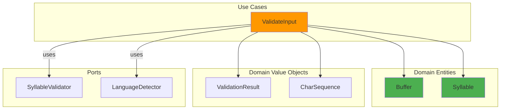
```mermaid
graph TD
    subgraph "Use Cases"
        VI[ValidateInput]
    end
    
    subgraph "Domain Entities"
        BUF[Buffer]
        SYL[Syllable]
    end
    
    subgraph "Domain Value Objects"
        VR[ValidationResult]
        CS[CharSequence]
    end
    
    subgraph "Ports"
        SV[SyllableValidator]
        LD[LanguageDetector]
    end
    
    VI --> BUF
    VI --> SYL
    VI --> VR
    VI --> CS
    VI -->|uses| SV
    VI -->|uses| LD
    
    style VI fill:#FF9800
    style BUF fill:#4CAF50
    style SYL fill:#4CAF50
```

---

### TransformText Use Case

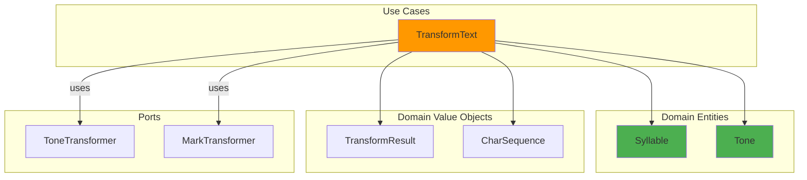
```mermaid
graph TD
    subgraph "Use Cases"
        TX[TransformText]
    end
    
    subgraph "Domain Entities"
        SYL[Syllable]
        TONE[Tone]
    end
    
    subgraph "Domain Value Objects"
        TR[TransformResult]
        CS[CharSequence]
    end
    
    subgraph "Ports"
        TT[ToneTransformer]
        MT[MarkTransformer]
    end
    
    TX --> SYL
    TX --> TONE
    TX --> TR
    TX --> CS
    TX -->|uses| TT
    TX -->|uses| MT
    
    style TX fill:#FF9800
    style SYL fill:#4CAF50
    style TONE fill:#4CAF50
```

---

### ManageShortcuts Use Case

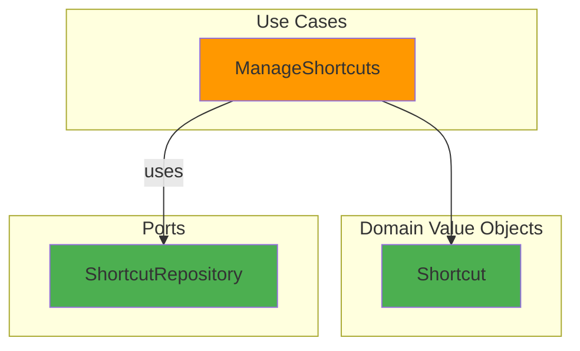
```mermaid
graph TD
    subgraph "Use Cases"
        MS[ManageShortcuts]
    end
    
    subgraph "Domain Value Objects"
        SC[Shortcut]
    end
    
    subgraph "Ports"
        SR[ShortcutRepository]
    end
    
    MS --> SC
    MS -->|uses| SR
    
    style MS fill:#FF9800
    style SC fill:#4CAF50
    style SR fill:#4CAF50
```

---

## Service Dependencies

### ProcessorService

Main orchestration service that coordinates all processing.

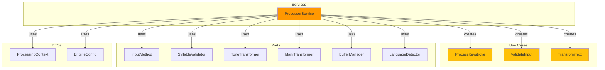
```mermaid
graph TD
    subgraph "Services"
        PS[ProcessorService]
    end
    
    subgraph "Use Cases"
        PK[ProcessKeystroke]
        VI[ValidateInput]
        TX[TransformText]
    end
    
    subgraph "Ports"
        IM[InputMethod]
        SV[SyllableValidator]
        TT[ToneTransformer]
        MT[MarkTransformer]
        BM[BufferManager]
        LD[LanguageDetector]
    end
    
    subgraph "DTOs"
        PC[ProcessingContext]
        EC[EngineConfig]
    end
    
    PS -->|creates| PK
    PS -->|creates| VI
    PS -->|creates| TX
    PS -->|uses| IM
    PS -->|uses| SV
    PS -->|uses| TT
    PS -->|uses| MT
    PS -->|uses| BM
    PS -->|uses| LD
    PS -->|uses| PC
    PS -->|uses| EC
    
    style PS fill:#FF9800
    style PK fill:#FFC107
    style VI fill:#FFC107
    style TX fill:#FFC107
```

---

### ConfigService

Manages engine configuration.

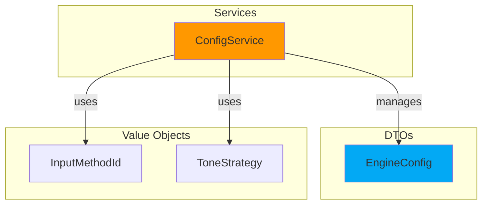
```mermaid
graph TD
    subgraph "Services"
        CS[ConfigService]
    end
    
    subgraph "DTOs"
        EC[EngineConfig]
    end
    
    subgraph "Value Objects"
        IM[InputMethodId]
        TS[ToneStrategy]
    end
    
    CS -->|manages| EC
    CS -->|uses| IM
    CS -->|uses| TS
    
    style CS fill:#FF9800
    style EC fill:#03A9F4
```

---

## Module Structure

### Complete Module Dependency Graph

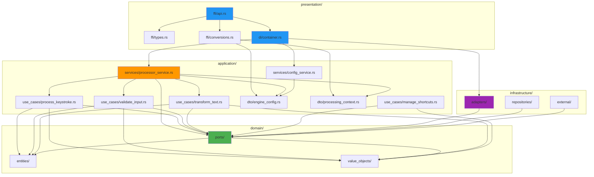
```mermaid
graph TD
    subgraph "presentation/"
        FFI_API[ffi/api.rs]
        FFI_TYPES[ffi/types.rs]
        FFI_CONV[ffi/conversions.rs]
        DI_CONT[di/container.rs]
    end
    
    subgraph "application/"
        PS[services/processor_service.rs]
        CS[services/config_service.rs]
        PK[use_cases/process_keystroke.rs]
        VI[use_cases/validate_input.rs]
        TX[use_cases/transform_text.rs]
        MS[use_cases/manage_shortcuts.rs]
        EC[dto/engine_config.rs]
        PC[dto/processing_context.rs]
    end
    
    subgraph "domain/"
        PORTS[ports/]
        ENT[entities/]
        VO[value_objects/]
    end
    
    subgraph "infrastructure/"
        ADAPT[adapters/]
        REPO[repositories/]
        EXT[external/]
    end
    
    FFI_API --> FFI_TYPES
    FFI_API --> FFI_CONV
    FFI_API --> DI_CONT
    DI_CONT --> PS
    DI_CONT --> CS
    DI_CONT --> ADAPT
    
    FFI_CONV --> EC
    FFI_CONV --> PC
    
    PS --> PK
    PS --> VI
    PS --> TX
    PS --> PORTS
    PS --> EC
    PS --> PC
    
    CS --> EC
    
    PK --> PORTS
    PK --> ENT
    PK --> VO
    VI --> PORTS
    VI --> ENT
    VI --> VO
    TX --> PORTS
    TX --> ENT
    TX --> VO
    MS --> PORTS
    MS --> VO
    
    ADAPT --> PORTS
    REPO --> PORTS
    EXT --> PORTS
    
    PORTS --> ENT
    PORTS --> VO
    
    style FFI_API fill:#2196F3
    style DI_CONT fill:#2196F3
    style PS fill:#FF9800
    style PORTS fill:#4CAF50
    style ADAPT fill:#9C27B0
```

---

## Dependency Inversion in Action

### Before (Traditional Layered Architecture)

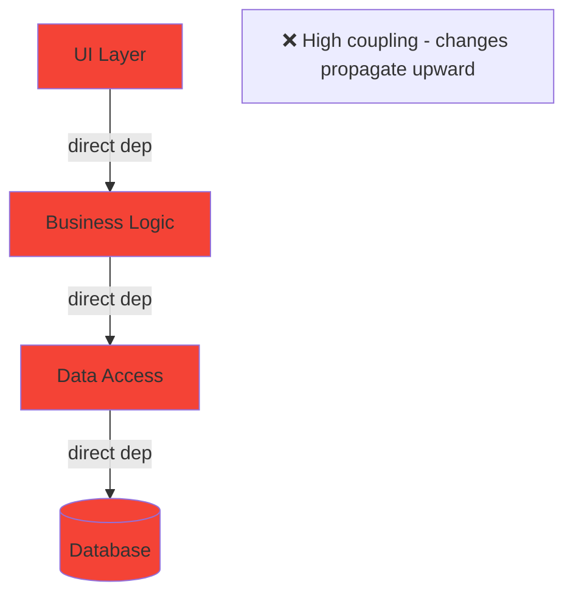
```mermaid
graph TD
    UI[UI Layer] -->|direct dep| BL[Business Logic]
    BL -->|direct dep| DATA[Data Access]
    DATA -->|direct dep| DB[(Database)]
    
    style UI fill:#f44336
    style BL fill:#f44336
    style DATA fill:#f44336
    style DB fill:#f44336
    
    NOTE["❌ High coupling - changes propagate upward"]
```

---

### After (Clean Architecture with DIP)

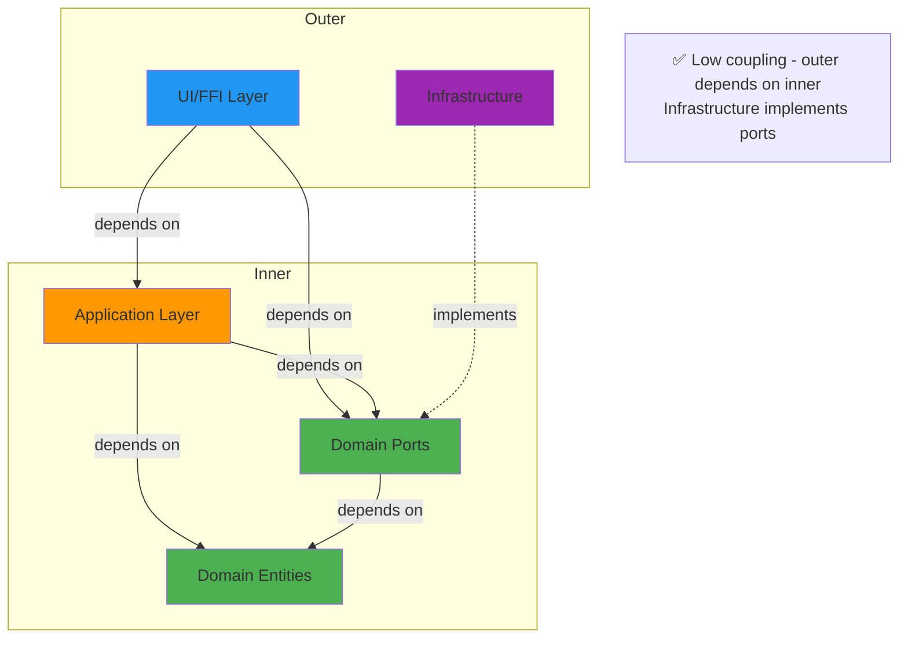
```mermaid
graph TD
    subgraph "Outer"
        UI[UI/FFI Layer]
        INFRA[Infrastructure]
    end
    
    subgraph "Inner"
        APP[Application Layer]
        PORTS[Domain Ports]
        DOMAIN[Domain Entities]
    end
    
    UI -->|depends on| APP
    UI -->|depends on| PORTS
    APP -->|depends on| PORTS
    APP -->|depends on| DOMAIN
    PORTS -->|depends on| DOMAIN
    
    INFRA -.implements.-> PORTS
    
    style PORTS fill:#4CAF50
    style DOMAIN fill:#4CAF50
    style APP fill:#FF9800
    style UI fill:#2196F3
    style INFRA fill:#9C27B0
    
    NOTE["✅ Low coupling - outer depends on inner<br/>Infrastructure implements ports"]
```

**Key Difference:**
- **Traditional**: High-level modules depend on low-level modules
- **Clean Architecture**: Both depend on abstractions (ports/traits)

---

## Adapter Patterns

### Input Method Adapters

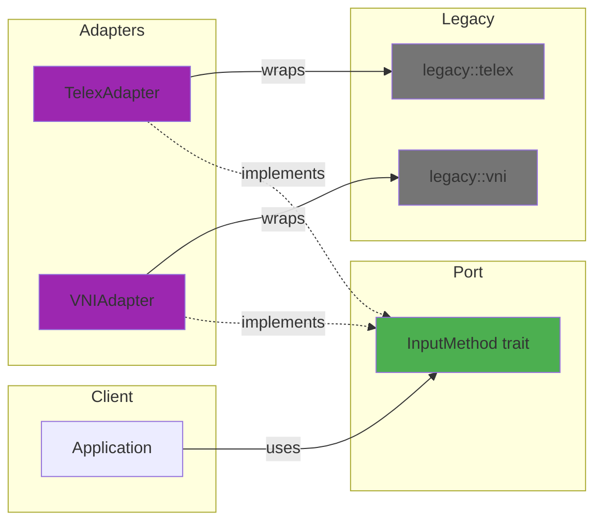
```mermaid
graph LR
    subgraph "Client"
        APP[Application]
    end
    
    subgraph "Port"
        PORT[InputMethod trait]
    end
    
    subgraph "Adapters"
        TELEX[TelexAdapter]
        VNI[VNIAdapter]
    end
    
    subgraph "Legacy"
        LEGACY_T[legacy::telex]
        LEGACY_V[legacy::vni]
    end
    
    APP -->|uses| PORT
    TELEX -.implements.-> PORT
    VNI -.implements.-> PORT
    TELEX -->|wraps| LEGACY_T
    VNI -->|wraps| LEGACY_V
    
    style PORT fill:#4CAF50
    style TELEX fill:#9C27B0
    style VNI fill:#9C27B0
    style LEGACY_T fill:#757575
    style LEGACY_V fill:#757575
```

**Purpose:** Wrap legacy code without modifying it, expose clean interface.

---

## Repository Patterns

### Dictionary Repository

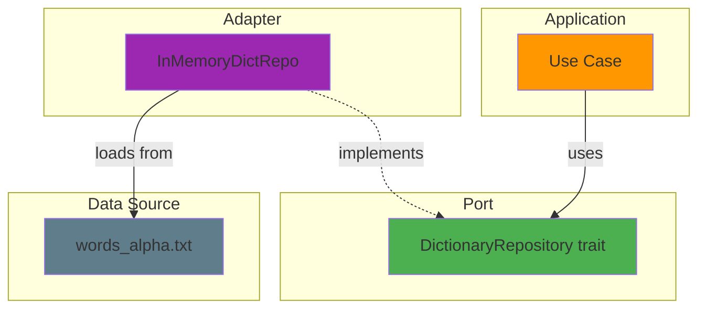
```mermaid
graph TD
    subgraph "Application"
        UC[Use Case]
    end
    
    subgraph "Port"
        PORT[DictionaryRepository trait]
    end
    
    subgraph "Adapter"
        ADAPT[InMemoryDictRepo]
    end
    
    subgraph "Data Source"
        FILE[words_alpha.txt]
    end
    
    UC -->|uses| PORT
    ADAPT -.implements.-> PORT
    ADAPT -->|loads from| FILE
    
    style PORT fill:#4CAF50
    style ADAPT fill:#9C27B0
    style UC fill:#FF9800
    style FILE fill:#607D8B
```

**Purpose:** Abstract data access, allow easy swapping (in-memory → database → network).

---

## FFI Integration Flow

### Complete Processing Flow

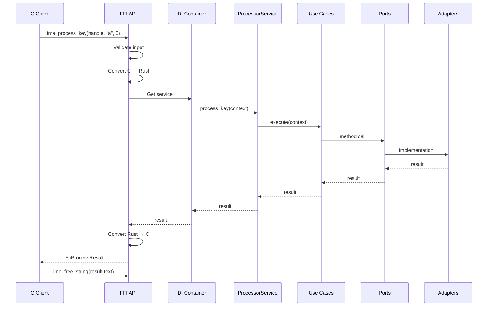
```mermaid
sequenceDiagram
    participant C as C Client
    participant FFI as FFI API
    participant DI as DI Container
    participant SVC as ProcessorService
    participant UC as Use Cases
    participant PORT as Ports
    participant ADAPT as Adapters
    
    C->>FFI: ime_process_key(handle, "a", 0)
    FFI->>FFI: Validate input
    FFI->>FFI: Convert C → Rust
    FFI->>DI: Get service
    DI->>SVC: process_key(context)
    SVC->>UC: execute(context)
    UC->>PORT: method call
    PORT->>ADAPT: implementation
    ADAPT-->>PORT: result
    PORT-->>UC: result
    UC-->>SVC: result
    SVC-->>DI: result
    DI-->>FFI: result
    FFI->>FFI: Convert Rust → C
    FFI-->>C: FfiProcessResult
    C->>FFI: ime_free_string(result.text)
```

---

## Testing Dependency Injection

### How Tests Use DI

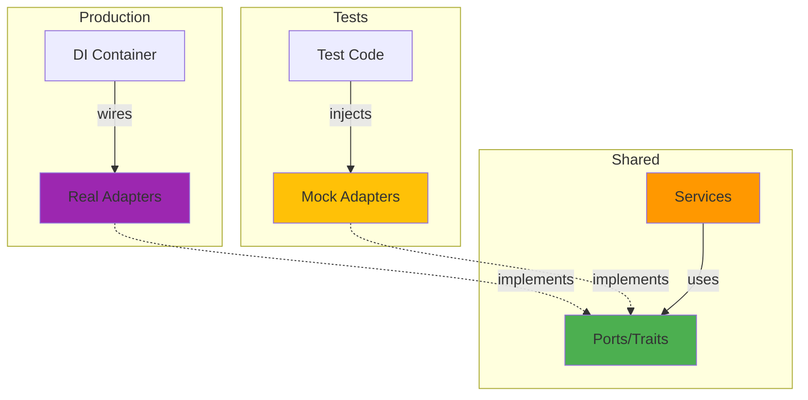
```mermaid
graph TD
    subgraph "Production"
        PROD_DI[DI Container]
        PROD_ADAPT[Real Adapters]
    end
    
    subgraph "Tests"
        TEST[Test Code]
        MOCK[Mock Adapters]
    end
    
    subgraph "Shared"
        PORT[Ports/Traits]
        SVC[Services]
    end
    
    PROD_DI -->|wires| PROD_ADAPT
    PROD_ADAPT -.implements.-> PORT
    TEST -->|injects| MOCK
    MOCK -.implements.-> PORT
    SVC -->|uses| PORT
    
    style PORT fill:#4CAF50
    style SVC fill:#FF9800
    style PROD_ADAPT fill:#9C27B0
    style MOCK fill:#FFC107
```

**Benefit:** Tests inject mocks, production injects real implementations - same interface!

---

## Circular Dependency Prevention

### ❌ Circular Dependency (Forbidden)

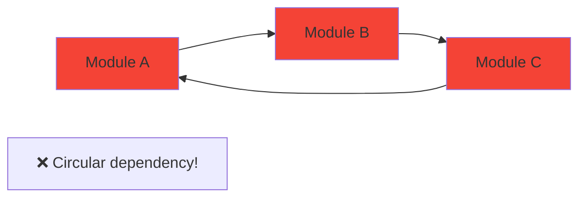
```mermaid
graph LR
    A[Module A] --> B[Module B]
    B --> C[Module C]
    C --> A
    
    style A fill:#f44336
    style B fill:#f44336
    style C fill:#f44336
    
    NOTE["❌ Circular dependency!"]
```

---

### ✅ Dependency Inversion (Correct)

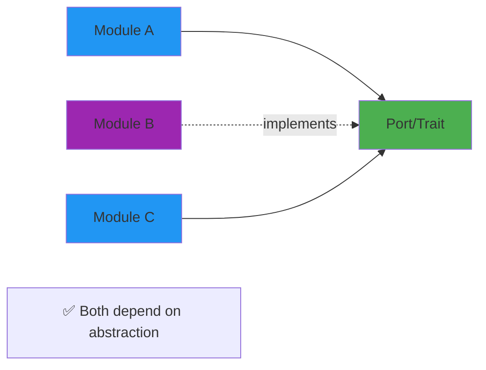
```mermaid
graph LR
    A[Module A] --> PORT[Port/Trait]
    B[Module B] -.implements.-> PORT
    C[Module C] --> PORT
    
    style PORT fill:#4CAF50
    style A fill:#2196F3
    style B fill:#9C27B0
    style C fill:#2196F3
    
    NOTE["✅ Both depend on abstraction"]
```

---

## Summary

### Architecture Principles Visualized

| Principle | Diagram | Location |
|-----------|---------|----------|
| **Dependency Rule** | Layer Dependencies | [Link](#layer-dependencies) |
| **Dependency Inversion** | Port Implementations | [Link](#port-implementations) |
| **Adapter Pattern** | Input/Validation/Transform | [Link](#adapter-patterns) |
| **Repository Pattern** | Data Access | [Link](#repository-patterns) |
| **Dependency Injection** | Container Wiring | [Link](#service-dependencies) |

---

### Key Takeaways

1. **Dependencies point inward** (toward domain)
2. **Ports define contracts** (traits), adapters implement them
3. **Services orchestrate** use cases and ports
4. **Use cases execute** business logic
5. **FFI/DI sit at the edge**, wiring everything together

---

## Tools Used

- **Mermaid**: All diagrams are Mermaid syntax
- **Rendering**: GitHub, VS Code with Mermaid extension, or https://mermaid.live

---

**Last Updated:** 2026-02-11  
**Version:** 1.0.0
