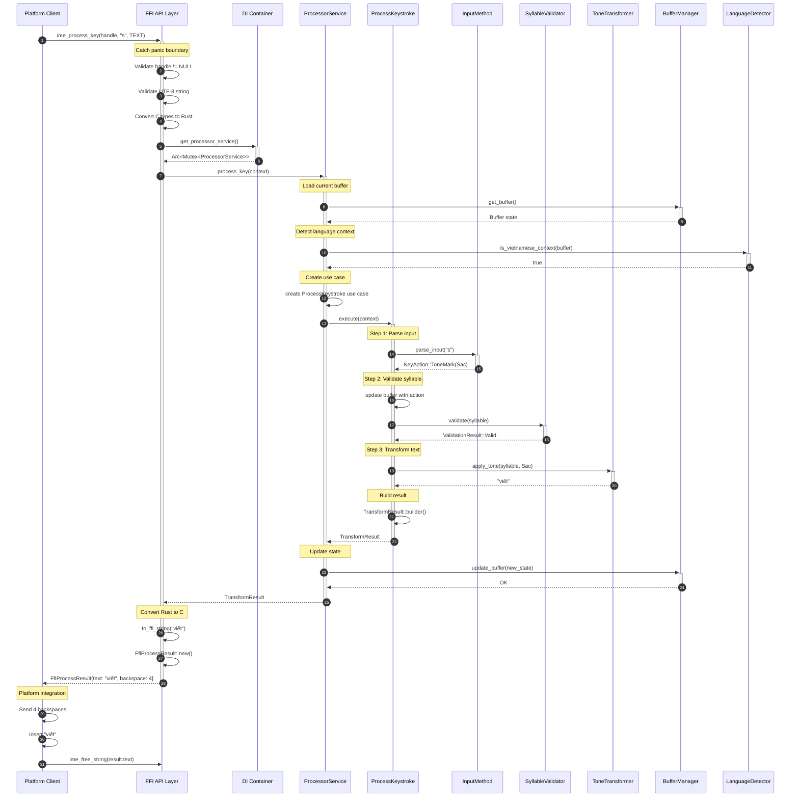
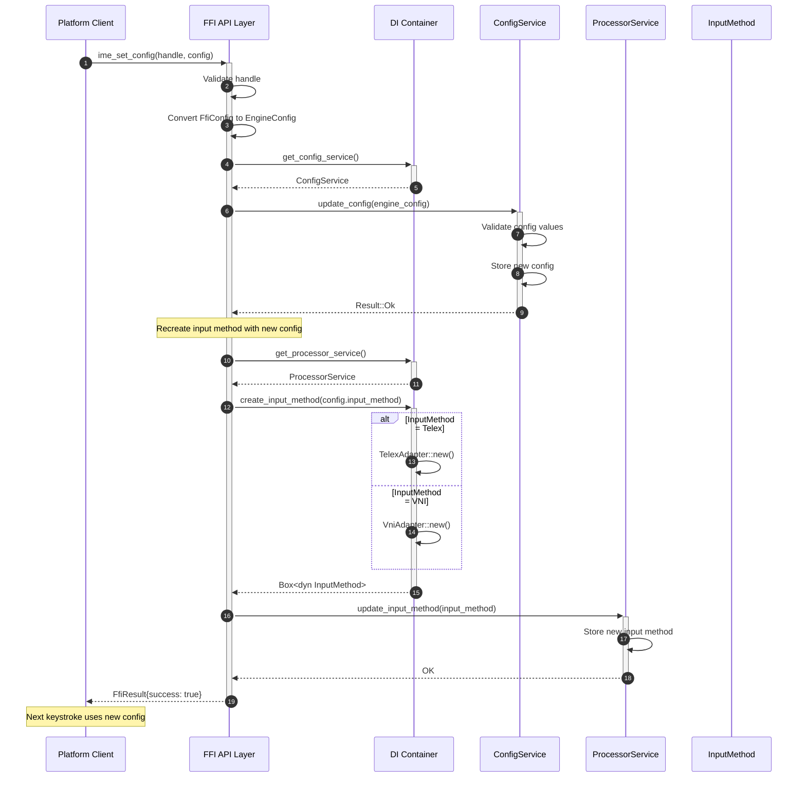
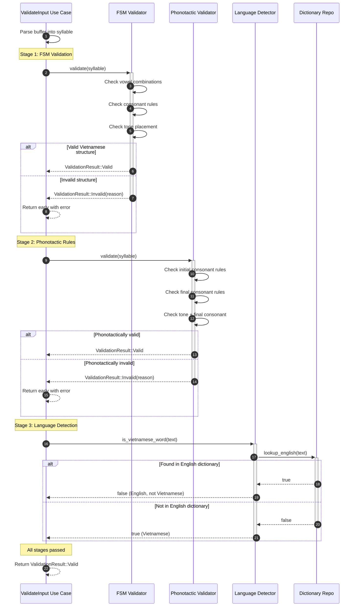
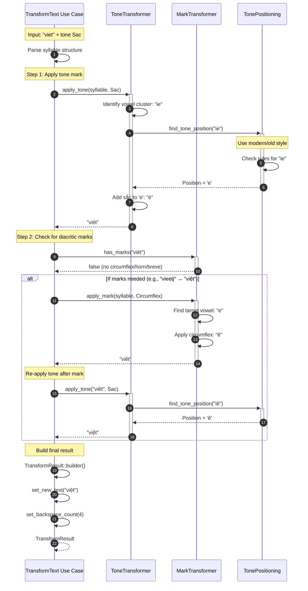
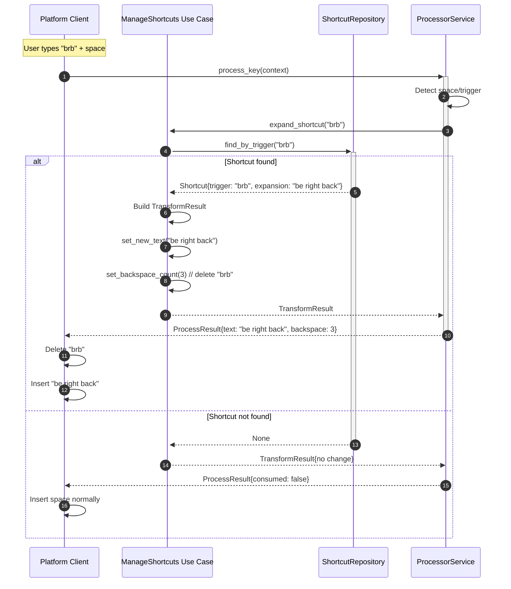
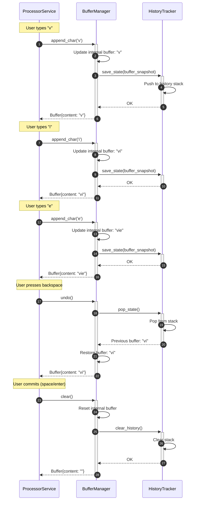
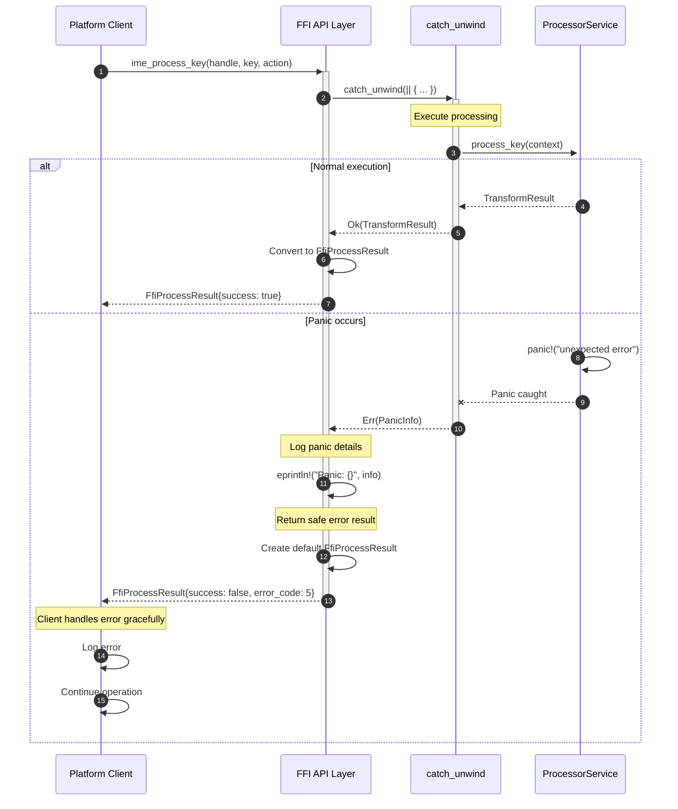
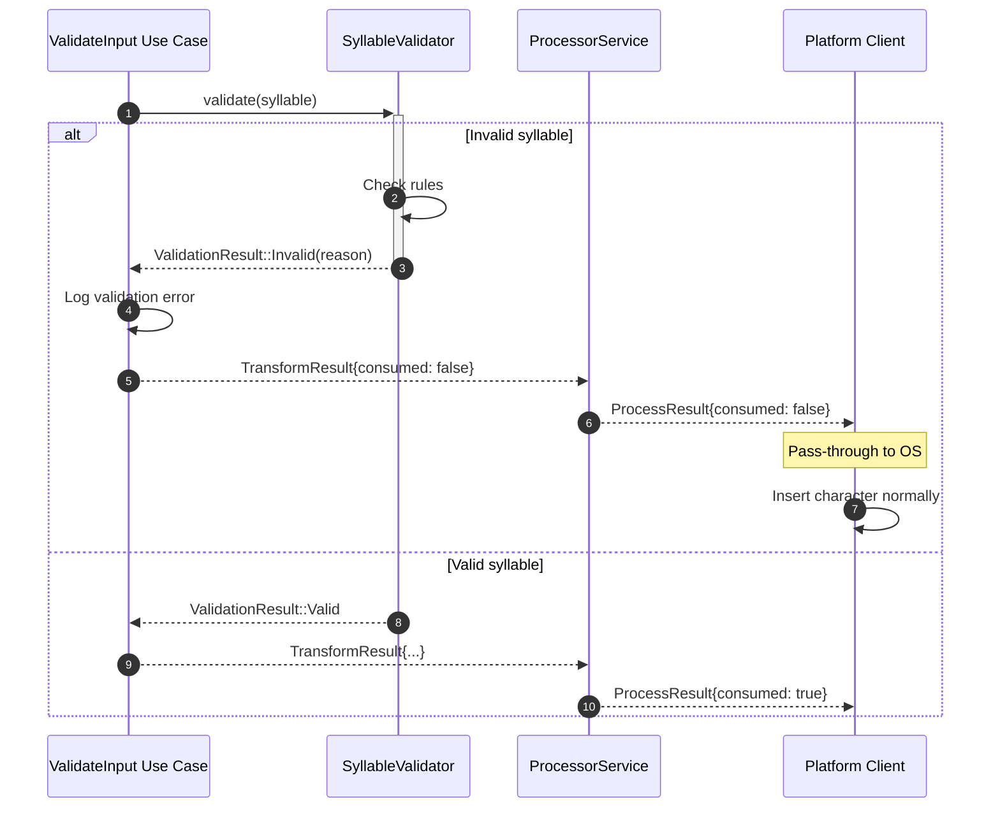
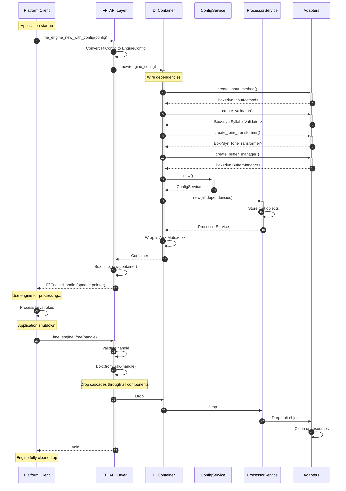

# GoxViet Core - Sequence Diagrams

This document contains detailed sequence diagrams showing the flow of data and control through the GoxViet core engine for key operations.

---

## Table of Contents

1. [Keystroke Processing Flow](#keystroke-processing-flow)
2. [Configuration Update Flow](#configuration-update-flow)
3. [Validation Pipeline Flow](#validation-pipeline-flow)
4. [Transformation Pipeline Flow](#transformation-pipeline-flow)
5. [Shortcut Expansion Flow](#shortcut-expansion-flow)
6. [Buffer Management Flow](#buffer-management-flow)
7. [Error Handling Flow](#error-handling-flow)
8. [Engine Lifecycle](#engine-lifecycle)

---

## Keystroke Processing Flow

### Complete End-to-End Flow

**Key Points:**
1. **Panic safety**: All FFI calls wrapped in catch_unwind
2. **Validation**: Input validated before processing
3. **State management**: Buffer updated after successful transformation
4. **Memory safety**: Client responsible for freeing result strings

---

## Configuration Update Flow

### Updating Engine Configuration

**Key Points:**
1. **Hot reload**: Configuration can be changed at runtime
2. **No restart**: Engine continues with new settings
3. **Atomic update**: All components updated consistently

---

## Validation Pipeline Flow

### Multi-stage Validation

**Key Points:**
1. **Multi-stage**: Three independent validators
2. **Short-circuit**: Fails fast on first error
3. **Independent**: Each validator has single responsibility

---

## Transformation Pipeline Flow

### Tone and Mark Application

**Key Points:**
1. **Order matters**: Marks first, then tones
2. **Re-application**: Tone position recalculated after marks
3. **Strategy pattern**: Modern vs old tone placement

---

## Shortcut Expansion Flow

### Text Expansion

**Key Points:**
1. **Trigger detection**: Space, Enter, or punctuation
2. **Repository pattern**: Shortcuts stored independently
3. **Optional feature**: Can be disabled via config

---

## Buffer Management Flow

### State Tracking

**Key Points:**
1. **Immutable snapshots**: Each state saved separately
2. **Undo support**: History stack enables backspace undo
3. **Memory management**: History limited to N entries

---

## Error Handling Flow

### Panic Recovery at FFI Boundary

**Key Points:**
1. **No panic propagation**: All panics caught at FFI boundary
2. **Safe fallback**: Default error result returned
3. **Client resilience**: Platform code continues operating

---

### Validation Error Handling

**Key Points:**
1. **Non-blocking**: Invalid input passed through
2. **Graceful degradation**: Engine doesn't crash, just doesn't transform
3. **User experience**: Natural typing continues

---

## Engine Lifecycle

### Initialization and Cleanup

**Key Points:**
1. **RAII**: Rust ownership ensures cleanup
2. **Cascading drops**: All resources freed automatically
3. **No memory leaks**: Smart pointers handle everything

---

## Summary

### Flow Patterns

| Flow | Complexity | Key Pattern | Actors |
|------|-----------|-------------|---------|
| **Keystroke Processing** | High | Orchestration | 9 components |
| **Configuration Update** | Medium | Hot reload | 5 components |
| **Validation Pipeline** | Medium | Chain of responsibility | 4 validators |
| **Transformation Pipeline** | Medium | Strategy + Chain | 3 transformers |
| **Shortcut Expansion** | Low | Repository | 3 components |
| **Buffer Management** | Medium | Memento | 2 state managers |
| **Error Handling** | Low | Fail-safe | 2 layers |
| **Engine Lifecycle** | High | RAII | 6 components |

---

### Common Patterns Observed

1. **Dependency Injection**: Services receive dependencies via constructor
2. **Result/Option**: No exceptions, explicit error handling
3. **Trait Objects**: Box<dyn Trait> for runtime polymorphism
4. **Smart Pointers**: Arc<Mutex<>> for thread-safe sharing
5. **RAII**: Automatic cleanup via Drop trait
6. **Panic Safety**: catch_unwind at FFI boundaries

---

## Tools Used

- **Mermaid**: All diagrams use Mermaid sequence syntax
- **Rendering**: GitHub, VS Code with Mermaid extension, or https://mermaid.live

---

**Last Updated:** 2026-02-11  
**Version:** 1.0.0
